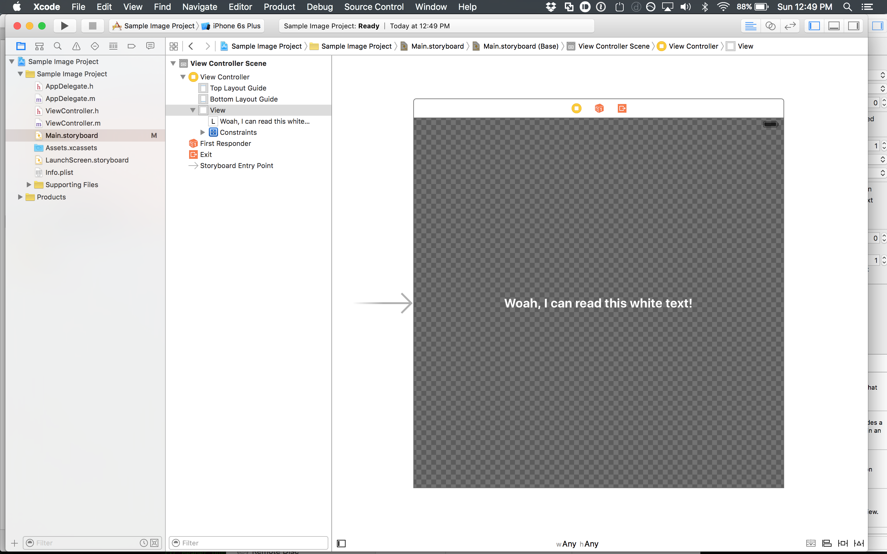

#IBAlphanizer

This plugin allows light content to be viewed in a storyboard if the view has transparency.

#Compatibility & installation

This plugin is tested only with Xcode 7.2. To install, just run the project, and the plugin should be copied to the correct directory

## Screenshot
